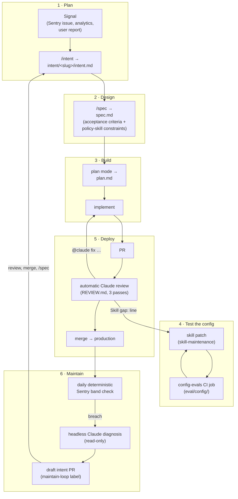
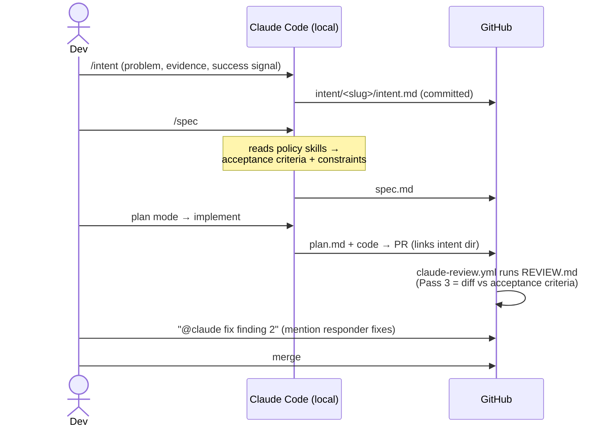

# ai-pipeline-template

Tooling for an **AI-native SDLC**: a complete, self-improving development loop
built on Claude Code, runnable on a **Claude Pro/Max subscription** (no
Teams/Enterprise features required). Inspired by Anthropic's
[AI-Native SDLC Playbook](https://claude.com/blog/the-ai-native-sdlc-playbook).

Every stage of the playbook — Plan → Design → Build → Test → Deploy →
Maintain — is implemented as version-controlled files in this repo: skills,
templates, CI workflows, and two small TypeScript harnesses. The loop closes:
production errors become intent drafts, review findings become skill patches,
and skill patches are regression-tested in CI.

This template was extracted from a production Next.js/TypeScript project
where the full loop runs daily. The workflows and skills are generic; the
TypeScript harnesses assume a Node project but are small enough to port.

## The loop



## What's in the box

| Stage | Files | What they do |
|---|---|---|
| 1 · Plan | [`intent/`](intent/README.md), [`.claude/skills/intent/`](.claude/skills/intent/SKILL.md) | `/intent` captures a problem + success signal as a committed `intent.md` |
| 2 · Design | [`intent/_templates/spec.md`](intent/_templates/spec.md), [`.claude/skills/spec/`](.claude/skills/spec/SKILL.md) | `/spec` writes numbered acceptance criteria and distills your policy skills into constraints |
| 3 · Build | [`AGENTS.md`](AGENTS.md), [`CLAUDE.md`](CLAUDE.md), [`.claude/skills/_template/`](.claude/skills/_template/SKILL.md) | Always-loaded instructions + the skill library that carries house rules between sessions |
| 4 · Test | [`eval/config/`](eval/config/cases.ts), [`.github/workflows/config-evals.yml`](.github/workflows/config-evals.yml) | Regression tests for the agent *config*: PRs touching `CLAUDE.md`/`AGENTS.md`/`.claude/**` replay golden prompts headlessly |
| 5 · Deploy | [`REVIEW.md`](REVIEW.md), [`.github/workflows/claude-review.yml`](.github/workflows/claude-review.yml), [`claude.yml`](.github/workflows/claude.yml) | Automatic 3-pass review of every PR + the `@claude` mention responder as the fix channel |
| 6 · Maintain | [`config/error-bands.ts`](config/error-bands.ts), [`scripts/monitor-error-bands.ts`](scripts/monitor-error-bands.ts), [`sentry-maintain-loop.yml`](.github/workflows/sentry-maintain-loop.yml) | Deterministic Sentry band detector → headless diagnosis → intent draft PR |
| Self-improvement | [`.claude/rules/skill-self-improvement/`](.claude/rules/skill-self-improvement/RULE.md), [`.claude/skills/skill-maintenance/`](.claude/skills/skill-maintenance/SKILL.md), [`.claude/hooks/skill-gap-reminder.sh`](.claude/hooks/skill-gap-reminder.sh) | Every session proposes (never writes unapproved) skill updates when a reusable gap surfaces; a turn-end hook nudges the reflection |

## Getting started

### 1. Copy into your repo

Use this repo as a GitHub template, or copy the directories into an existing
project. Then fill in the placeholders — they are all greppable:

```bash
grep -rn "TODO(template)" . --exclude-dir=node_modules
```

The big ones:

- **Integration branch** — the workflows filter on `main`; change the
  `branches:` filters and the maintain loop's `ref:`/`base:` if you
  integrate elsewhere (e.g. `develop`).
- **[`AGENTS.md`](AGENTS.md)** — your setup commands, code style, testing
  rules. Keep it short; point to skills for detail.
- **[`REVIEW.md`](REVIEW.md)** — replace the example Pass 1/2 bullets with
  your house rules.
- **Policy skills** — copy `.claude/skills/_template/` to create your
  `code-conventions` skill (and any domain skills), then list them in the
  `/spec` skill's mapping table.
- **[`eval/config/cases.ts`](eval/config/cases.ts)** — seed golden cases from
  your real past corrections (one works out of the box).
- **[`config/error-bands.ts`](config/error-bands.ts)** — tune Sentry queries
  and thresholds to your traffic.

### 2. Prerequisites

- A **Claude Pro or Max** subscription and the `claude` CLI installed locally.
- The `gh` CLI authenticated (used by the detector's PR dedupe and by review
  tooling).
- For the maintain loop: a Sentry project.
- Node ≥ 22 for the two TypeScript harnesses (`npm install` in this repo).

### 3. GitHub configuration

**Secrets** (repo → Settings → Secrets and variables → Actions):

| Secret | Used by | How to get it |
|---|---|---|
| `CLAUDE_CODE_OAUTH_TOKEN` | all Claude workflows | run `claude setup-token` locally — bills your Pro/Max subscription |
| `SENTRY_AUTH_TOKEN`, `SENTRY_ORG`, `SENTRY_PROJECT` | maintain loop | Sentry → Settings → Auth Tokens (issue read scope) |
| `PAT_GITHUB_ACTIONS` | maintain loop PR opening | classic PAT with `repo` scope — PRs opened with the default `github.token` don't trigger other workflows |
| `SLACK_WEBHOOK`, `SLACK_CHANNEL` | maintain loop notifications (optional) | Slack incoming webhook, or delete the Slack steps |

**Labels** (create once):

- `skip-claude-review` — opt a PR out of the automatic review.
- `maintain-loop` — applied to intent draft PRs; the detector scans open PRs
  with this label to dedupe.

Optionally mark **"Config Evals / evals"** as a required status check — the
workflow always completes (non-config PRs no-op in seconds), so it's safe to
require.

### 4. First-run checks

1. Open a PR after merging the workflows and watch the Claude review post
   its sticky comment. (On the bootstrap PR that *adds* `claude-review.yml`,
   the action's workflow-validation guard skips the run — expected; the first
   real review happens on the next PR.)
2. Run the eval harness locally: `npm run ai:eval:config`.
3. Run the band detector locally against real Sentry data (put `SENTRY_*`
   in `.env.local`): `npm run monitor:error-bands` — tune thresholds until a
   quiet day comes back empty.
4. Trigger the maintain loop end-to-end once:
   Actions → Sentry Maintain Loop → Run workflow → `force = true`.

## Using the pipeline day-to-day

### Feature work



1. `/intent` → review the draft → accept.
2. `/spec` → it reads the relevant policy skills and writes acceptance
   criteria. Resolve any flagged policy conflicts now, not at review time.
3. Plan mode; save the approved plan as `plan.md` in the intent dir.
4. Implement; open the PR with the template, linking the intent dir.
5. The automatic review checks correctness, security, and the diff against
   your own acceptance criteria. Fix via `@claude` mentions or locally.

Small changes skip the chain — write "small change — no artifact" in the PR.

### Production errors (the maintain loop)

Runs daily. Quiet days cost zero Claude usage — detection is a plain
TypeScript script. On a breach:

1. The diagnose job investigates read-only and writes a draft
   `intent/<slug>/intent.md` (diagnosis hypothesis + Sentry permalink +
   measurable success signal), opened as a PR labeled `maintain-loop`.
2. You review/edit the diagnosis and merge.
3. Run `/spec` on it — you're back in the feature flow at step 2.

Dedupe is two-layered: open `maintain-loop` PR bodies (transient) and
committed `intent/**` markdown (durable), both scanned for Sentry permalinks.

### Config changes (the self-improvement loop)

1. A review finding recurs → the review's summary ends with a
   `Skill gap:` line, or a session proposes a skill patch at turn end (the
   Stop hook nudges the reflection; the rule forbids writing without your
   approval).
2. You approve; the patch lands in `.claude/skills/…` with a
   `metadata.version` bump.
3. The PR touches `.claude/**`, so **config-evals** replays the golden
   prompts headlessly against the changed config. Seed a new golden case
   whenever a correction was painful enough that you never want to repeat it
   — and *mutation-test* it (delete the rule, watch the case go red).

## Gotchas learned in production

These cost real debugging time in the source project — they're baked into the
template, but worth knowing:

- **Headless `claude -p` + a Stop hook**: with `--output-format json`, the
  `result` field is the *last* assistant message — which, with the
  skill-gap-reminder hook installed, is the hook reflection, not the answer.
  The eval runner therefore uses `--output-format stream-json --verbose` and
  joins all assistant messages. Keep doing that in any harness you add.
- **`gh pr view` cannot see inline review comments.** File-anchored review
  threads live in a different API resource: `gh api repos/<owner>/<repo>/pulls/<n>/comments`.
  REVIEW.md's dedupe against other bots depends on this.
- **Path-filtered required checks hang PRs.** That's why `config-evals.yml`
  always runs and self-detects config changes via `gh pr diff --name-only`
  instead of using a `paths:` filter (or a paths-ignore "twin", which
  double-fires on mixed-path PRs).
- **Bot-opened PRs**: use a classic PAT (not `github.token`) in
  `peter-evans/create-pull-request` or the review workflow won't fire on the
  intent draft PRs; conversely, those PRs carry `skip-claude-review` +
  a `maintain/` branch guard so they don't burn review runs.
- **Per-run branch names** in the maintain loop: a fixed branch would make
  the next breach *replace* the open PR's body, losing the permalinks the
  detector dedupes on.
- **Standalone CI scripts never initialize Sentry** — don't add
  `Sentry.captureException` to them for "compliance"; it sends nothing. Fail
  loudly via exit code + a workflow notification step.
- **Usage limits**: CI reviews share your Pro/Max usage windows with local
  sessions. The workflows mitigate with concurrency-cancel, draft/bot/label
  skips, and Sonnet (not Opus). If CI starves local work, switch the review
  workflow to a pay-per-token `ANTHROPIC_API_KEY` (the action accepts
  `anthropic_api_key` instead of `claude_code_oauth_token`).

## What this template does NOT include

Enterprise/Teams features the playbook mentions that have no Pro/Max
equivalent: managed code review, managed settings/sandbox, Claude Security
scanning, and org-wide skill distribution. Their spirit is covered by
`REVIEW.md` (review), this repo's committed `.claude/` (distribution via
git), and the config-evals gate (governance).

## License

MIT — see [LICENSE](LICENSE).
