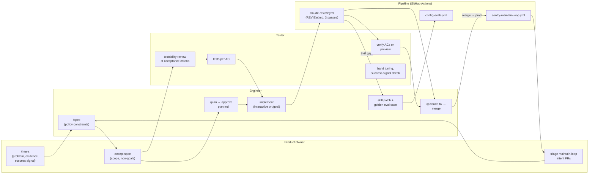

# Prompting the pipeline — stage-by-stage examples and team roles

The [README](../README.md) explains *what* each stage of the loop is. This
guide is the practical companion: **what you actually type**, at which stage,
and **who on the team types it**.

Two ideas underpin every example here:

1. **The artifacts are the contract between stages.** `intent.md`, `spec.md`
   and `plan.md` are files in the repo, so every prompt references them with
   `@intent/<slug>/…` instead of re-explaining the feature from memory. A
   Claude session starts blank; the artifact is how the previous stage's
   decisions reach it — and how the automated reviewer (REVIEW.md Pass 3)
   later checks the diff against the *same* acceptance criteria you built to.
2. **Humans trigger and approve; automation runs and reports.** Stages 1–3
   start with a person typing a command. Stages 4–6 start with a GitHub
   event. Nothing in the loop merges, writes a skill, or accepts a plan
   without a human saying so.

Commands referenced below are current Claude Code built-ins
(`/plan`, `/goal`, `/loop`, `/code-review`, `@file`), verified against the
[Claude Code docs](https://code.claude.com/docs/en/commands) at the time of
writing. The two project commands (`/intent`, `/spec`) are the skills shipped
in this template.

Playbook reference: [The AI-Native SDLC Playbook](https://claude.com/blog/the-ai-native-sdlc-playbook).

---

## At a glance: who triggers what



| Stage | Trigger | Who types it | Where | Human gate |
|---|---|---|---|---|
| 1 · Plan | `/intent …` | Product Owner (Engineer for tech debt) | local Claude Code | intent `Status: accepted` |
| 2 · Design | `/spec intent/<slug>` | Engineer, reviewed by PO + Tester | local | spec accepted; conflicts resolved |
| 3 · Build | `/plan …` → approve → implement | Engineer | local (or `@claude` in CI) | plan approved before any edit |
| 4 · Test config | PR touching `.claude/**` | nobody — CI event | GitHub Actions | eval red blocks merge |
| 5 · Deploy | PR opened / updated | nobody — CI event; `@claude` fixes by Engineer | GitHub Actions | merge is manual |
| 6 · Maintain | daily cron / `workflow_dispatch` | nobody — CI event; triage by PO | GitHub Actions | intent PR reviewed before `/spec` |

---

## Stage 1 · Plan — `/intent`

**Who:** Product Owner. The engineer runs it for technical intents (a
migration, a flaky-test cleanup). Never the pipeline — except the maintain
loop, which writes its own with `Source: maintain-loop`.

**From a user report or ticket:**

```text
/intent Users on the mobile app report that "Save" does nothing after their
session expired — 14 support tickets this week (see ticket #482). Desired
outcome: the tap either succeeds or shows a clear "sign in again" prompt.
Non-goal: changing session length.
```

**From a Sentry issue** (paste the permalink — the skill extracts from it):

```text
/intent https://sentry.io/organizations/<org>/issues/<id>/
```

**From an analytics finding:**

```text
/intent Only 3% of visitors who open the filter panel apply a filter (query:
analytics events "filter_open" vs "filter_apply", last 30 days). Hypothesis:
the Apply button is below the fold on small screens. Success signal:
apply/open ratio above 15% for 14 days after release.
```

The skill interviews you for whatever the template needs and **refuses to
invent a success signal** — if you have none, the file says so, and that is
information for the spec stage.

**Accepting an intent** (the gate before Stage 2). Review the draft file, then:

```text
Set Status: accepted in @intent/2026-09-save-after-expiry/intent.md and
commit it on a branch named intent/save-after-expiry.
```

---

## Stage 2 · Design — `/spec`

**Who:** Engineer runs it; Product Owner and Tester review the result. This is
the "three amigos" moment: the PO owns scope, the engineer owns constraints,
the tester owns testability.

**Run it against the accepted intent:**

```text
/spec intent/2026-09-save-after-expiry
```

The skill reads every policy skill whose domain the intent touches and
distills them into the spec's *Policy constraints* section. If a constraint
conflicts with the intent (e.g. the intent wants an external link that policy
says must be validated first), it flags it — **resolve that now**, in the
spec, not at review time.

**Engineer follow-ups:**

```text
AC 2 depends on a backend change that is out of scope for this PR. Split it:
keep the client behaviour in this spec, move the API change to "Out of
scope" with a pointer to a follow-up intent.
```

**Tester's testability review** — the single most valuable prompt at this stage:

```text
Read @intent/2026-09-save-after-expiry/spec.md. For each numbered acceptance
criterion, write (a) the manual steps a tester would follow and (b) the
automated test that would prove it. Flag any criterion that cannot be
verified from the outside and propose a rewording that can.
```

Put the resulting test plan into the spec's *Test plan* section — the
implementation stage will reference it.

**Product Owner's acceptance:**

```text
Read @intent/2026-09-save-after-expiry/spec.md. Does anything in the
acceptance criteria go beyond the intent's Desired outcome, or contradict
its Non-goals? List each, then stop — I'll decide.
```

Commit `spec.md` next to `intent.md`. From here on the spec is *the* source
of truth; if implementation reveals it was wrong, change the spec first.

---

## Stage 3 · Build — plan, then implement

This stage has the most choices, so it gets the most detail. **Who:** the
Engineer, end to end. The Tester contributes the tests-per-AC (see 3d).

### 3a · Trigger planning

Three equivalent ways to enter plan mode — Claude reads and explores but
**cannot edit** until you approve:

| How | When |
|---|---|
| `/plan <task>` as a prefix on one prompt | the normal case — one prompt, plan mode on |
| `Shift+Tab` until the status bar shows `⏸ plan mode on` | you're already mid-session |
| `claude --permission-mode plan` | you want the whole session to start in plan mode |

**Should the intent and spec be referenced? Yes — always, by file.** The
planning prompt for this template's flow:

```text
/plan Implement @intent/2026-09-save-after-expiry/spec.md.

Read intent.md, spec.md and (if present) the test plan in that directory
first. The plan must:
- map EVERY numbered acceptance criterion to the files that will change and
  the test that proves it — an AC with no test in the plan is a gap, say so;
- list the Policy constraints from spec.md you will honour, and name the
  skill each comes from;
- call out anything in the spec you believe is wrong, ambiguous, or more
  expensive than it looks BEFORE proposing an approach;
- prefer the smallest change that satisfies the ACs — no refactors the spec
  didn't ask for.
```

Why `@file` and not pasted text: the `@` reference includes the file's
current content *and* pulls in `CLAUDE.md`/`AGENTS.md` context, so the plan
is built against the same bytes the reviewer will later read. Pasted text
drifts the moment someone edits the spec.

**Iterate inside plan mode.** When the plan appears you get three options:
*Yes, and use auto mode* · *Yes, manually approve edits* · *No, keep
planning*. Press `Ctrl+G` to open the plan in your editor and change it
directly. Typical "keep planning" replies:

```text
No, keep planning. Step 3 introduces a new hook; the code-conventions skill
says derived state uses the useState prev-value guard, not useEffect. Redo
step 3 with that.
```

```text
No, keep planning. AC 4 has no test in the plan. Add one that fails before
the change and passes after.
```

**Commit the plan — this is the step people skip.** Claude Code keeps its own
copy of the plan under `~/.claude/plans/`, but that is local and unversioned.
The artifact is the committed file:

```text
Save the approved plan verbatim to intent/2026-09-save-after-expiry/plan.md
and commit it on this branch before you change any other file.
```

(Approve with *Yes, manually approve edits* if you want to watch that first
write happen; *auto mode* if you trust the plan.)

### When planning finds a spec defect

The planning prompt above asks Claude to call out anything wrong in the spec
*before* proposing an approach, so sooner or later plan mode will stop with a
question like: *"AC 2 says prefer the API's `short_name` — but no such field
exists; `Team` has `short_code`, a 3-letter code. Which do I render?"* That
is the pipeline working. What matters is what you do next, because **the
spec is what the automated review checks the diff against**: answer the
question and move on, and you ship code built to an AC nobody believes
anymore — Pass 3 then either cries wolf or rubber-stamps.

**1. Classify the defect — it decides who answers.**

| Kind | Example | Who decides | Where the decision goes |
|---|---|---|---|
| Factual error about the code | `short_name` doesn't exist, `short_code` does | Engineer, on the spot | amended AC + a `## Decisions` entry |
| Ambiguous / conflicting behaviour | AC 4 and AC 7 can't both hold on mobile | Product Owner | amended AC; PO acknowledges on the PR |
| Policy conflict | an AC wants what a policy skill forbids | Engineer, citing the skill | Policy constraints + Decisions |
| The intent's outcome is wrong | the fix reveals the desired outcome is off | Product Owner — back to Stage 1 | `intent.md`, then re-run `/spec` |

The `short_name` case is the first kind: the desired outcome (readable names
in a fixed slot) is unchanged, only the field name was invented. Take the
option that matches the AC's own reasoning, no PO round-trip needed.

**2. Answer in the plan session, then make the spec fix the plan's first
step.** Plan mode can't edit files, so don't try to fix the spec from inside
it:

```text
Record this as a spec amendment. Step 1 of the plan must be: update
@intent/<slug>/spec.md AC 2 to say "render participant.name on one line with
text-overflow: ellipsis; full name in the link's aria-label — `short_name`
does not exist; `Team.short_code` is a 3-letter code and is NOT used here",
and add a dated entry under "## Decisions" explaining why. Commit that before
any code change.
```

The amended spec lands in the same PR as the implementation, so the reviewer
reads the corrected AC. `plan.md` carries the decision too.

**3. Never let the plan work around the spec silently.** If a question is
ever answered with "just do the sensible thing", the sensible thing still
gets written into `spec.md`. A spec that drifts from the code is worse than
no spec — it makes Pass 3 untrustworthy in both directions.

**4. Feed the root cause back to Stage 2.** An AC citing a field that doesn't
exist means `/spec` wrote it from the intent's prose without checking the
code. The `spec` skill in this template therefore requires every name an AC
cites to be grepped and cited as `file:line` — the check plan mode just did,
one stage earlier. If your `/spec` runs keep producing defects of one kind,
that is a skill patch, not a series of plan-mode questions.

### 3b · Trigger implementation — pick the mode that matches the risk

**Option A — interactive, step by step.** Best for risky or unfamiliar code.
After approval:

```text
Implement step 1 of @intent/2026-09-save-after-expiry/plan.md only. Run the
tests it names, show me the diff, and stop.
```

…then `step 2`, and so on. You stay in the loop at every step; the cost is
your attention.

**Option B — `/goal` for the whole plan.** `/goal` sets a completion
condition and Claude keeps taking turns until a separate small model judges
the condition met (or impossible). It is the right tool when the end state
is **verifiable from Claude's own output** — which is exactly what a spec
with numbered ACs and a test plan gives you:

```text
/goal Every acceptance criterion in intent/2026-09-save-after-expiry/spec.md
is implemented following intent/2026-09-save-after-expiry/plan.md, and:
- `npm run test:ci` and `npm run test:types` exit 0 (print the last 20
  lines of each as proof);
- every AC has at least one new test, and each new test was shown FAILING
  before the implementation that makes it pass;
- no file outside the plan's file list is modified (`git status --short`
  is printed and matches);
- or stop after 25 turns and report which ACs remain, with reasons.
```

How to write a condition that works — from the docs, in this template's terms:

- **State the check, not just the outcome.** The evaluator reads the
  transcript; it does not run commands. "Tests pass" is invisible unless
  Claude runs them and the output lands in the conversation — hence "print
  the last 20 lines".
- **Bound it.** A turn or time clause (`or stop after 25 turns`) is your
  budget. Without it, a stuck goal burns turns until you notice.
- **Pair it with auto mode** (the default on Pro/Max) so tool calls don't
  prompt between turns; a goal never changes your permission mode on its own.
- `/goal` with no argument shows status; `/goal clear` stops it early.

Don't use `/goal` when the spec is still ambiguous — the evaluator will
happily judge a wrong interpretation as "met". Ambiguity is a Stage 2 problem;
go back and fix the spec.

**Option C — unattended, in CI.** For work that fits comfortably in the plan
(mechanical migrations, follow-ups the spec fully pins down), the mention
responder in [`claude.yml`](../.github/workflows/claude.yml) runs the same
prompt on a GitHub issue or PR comment:

```text
@claude Implement intent/2026-09-save-after-expiry/plan.md on a branch off
develop. Follow spec.md's acceptance criteria and policy constraints exactly,
run the project's checks, and open a PR that links the intent directory.
Don't change anything the plan doesn't list.
```

The resulting PR then goes through the automatic review like any other. The
same thing from a terminal, headless:

```bash
claude -p "/goal <the condition from Option B>" \
  --permission-mode acceptEdits \
  --output-format stream-json --verbose
```

(`stream-json --verbose` matters: a many-turn goal prints nothing until it
ends otherwise. And if your repo has a Stop hook like this template's, it is
the only format whose output you can trust — see the README gotchas.)

**Option D — parallel work.** One engineer, two features:

```bash
claude --worktree save-after-expiry
```

gives the session its own checkout and branch, so two implementations never
collide in the working tree.

### 3c · Verify before opening the PR

```text
Run the full checks. Then, for each acceptance criterion in
@intent/2026-09-save-after-expiry/spec.md, state PASS or FAIL with the
evidence — the test name, or the screenshot path for UI criteria. Anything
FAIL: say why, don't fix yet.
```

Run the local reviewer against the same criteria the CI reviewer will use —
cheaper to hear it now:

```text
/code-review high
```

Then open the PR with the template, linking the intent dir:

```text
Open a PR against develop using the repo's PR template. Link
intent/2026-09-save-after-expiry/ in the Artifacts section and list which
acceptance criteria this PR covers.
```

### 3d · The Tester's prompts during Build

The tester can work in parallel with the engineer, from the spec alone:

```text
From the Test plan in @intent/2026-09-save-after-expiry/spec.md, write the
automated tests for AC 1–3 against the current code. They should FAIL now
(the feature isn't built) — run them and show me the failures. Don't touch
non-test files.
```

Failing tests committed ahead of the implementation are the strongest
possible acceptance criteria: the engineer's `/goal` condition can simply
say "the tests in `__tests__/save-after-expiry.test.ts` pass".

### Which mechanism, when

| You want | Use | Not |
|---|---|---|
| A change reviewed before it touches disk | plan mode (`/plan`) | `/goal` |
| Autonomous work toward a **verifiable** end state | `/goal` (bounded) | plan mode alone |
| Re-run something on a **time** interval (poll CI, watch a deploy) | `/loop 5m …` | `/goal` |
| A check that should fire **every** turn, in every session | a Stop hook in `.claude/settings.json` | `/goal` (session-scoped) |
| Work that runs while nobody is at the keyboard | `@claude` in CI, or `claude -p` | an interactive session left open |
| Two things at once | `claude --worktree` | two sessions in one checkout |

---

## Stage 4 · Test the config — evals and skill patches

**Who:** the Engineer writes the skill patch and the golden case; the Tester
owns the eval suite as a regression suite. **Triggered by:** any PR touching
`CLAUDE.md`/`AGENTS.md`/`.claude/**` — nobody runs it by hand in CI.

**Capturing a correction as a skill patch** — the session proposes, you
approve. The approval must be explicit:

```text
yes, draft it
```

(Per the self-improvement rule, "thanks" or "looks good" after an answer is
*not* approval — the rule is deliberately strict about this.)

**Adding a golden case for the correction:**

```text
Add a case to @eval/config/cases.ts for the rule we just captured: a prompt
an agent would actually face, mustMatch/mustNotMatch regexes on the answer
(case-insensitive, multi-alternative — avoid trap regexes that a correct
answer QUOTING the anti-pattern would trip), severity must-pass, guardedBy
naming the skill section.
```

**Mutation-test it — a green eval proves nothing until you have watched it go red:**

```text
Temporarily delete the rule from AGENTS.md (or the skill section it lives
in), run `npm run ai:eval:config -- --id <case-id>`, and show me the
failure. Then restore the file and run it again.
```

If it does not go red, the rule is guarded somewhere else too (a skill
description, a second doc) — note that in the case's `guardedBy` rather than
pretending the eval measures what it doesn't.

---

## Stage 5 · Deploy — review and merge

**Triggered by:** the PR itself. The review runs on open, on ready-for-review
and on every push; nobody prompts it. **Who acts on it:** the Engineer fixes,
the Tester verifies on the preview, a human merges.

**Fix a finding via the mention responder** (runs in CI, pushes to the PR
branch):

```text
@claude Fix finding 2 from the review — keep the change minimal and add the
missing test it names.
```

**Ask for a targeted re-check** instead of a full review:

```text
@claude Pass 3 only: re-check this diff against
intent/2026-09-save-after-expiry/spec.md and tell me which acceptance
criteria are still unmet.
```

**Tester, on the preview deployment:**

```text
Using the preview URL in this PR, walk through the manual steps for each AC
in @intent/2026-09-save-after-expiry/spec.md and screenshot the result of
each. Report PASS/FAIL per AC. Don't fix anything.
```

**Opting out** for mechanical PRs (dependency bumps, generated files): add
the `skip-claude-review` label. The bot-opened maintain-loop PRs carry it
automatically.

**Merging is always a person.** The pipeline never auto-merges — `CLEAN` from
GitHub and a green review are inputs to your decision, not the decision.

---

## Stage 6 · Maintain — the loop opens the PR, you triage it

**Triggered by:** the daily cron in `sentry-maintain-loop.yml`, or
`workflow_dispatch` with `force=true` to test. **Who acts:** Product Owner
triages (is this worth doing?), Engineer sanity-checks the diagnosis, Tester
tunes the bands.

**Triage a maintain-loop intent PR:**

```text
Review @intent/2026-09-checkout-timeout/intent.md — it was written by the
maintain loop. Verify the diagnosis hypothesis against the files and commits
it cites and the Sentry permalink. Then either set Status: accepted, or
write a Constraints note explaining why we're deferring it. Don't fix the bug.
```

Accepted → merge the intent PR → `/spec intent/2026-09-checkout-timeout` and
you are back at Stage 2.

**Tune a band** (Tester/Engineer — the thresholds are a reviewable diff):

```text
The api-errors band in @config/error-bands.ts fired three days running on the
same issue that we've already accepted an intent for. Confirm the dedupe
picked up the permalink from intent/**, and if the band is just too
sensitive, propose a new minEvents with the last 14 days of counts as
evidence.
```

**Test the loop end-to-end** without waiting for a breach: run the workflow
with `force=true` from the Actions tab; it writes a single test intent and
says so in the file.

---

## Which model, where

Match the model to the **stage's risk**, not to the loop as a whole. Two
rules of thumb before the table:

- **Locally, use aliases** (`sonnet`, `opus`, `fable`, `haiku`, `opusplan`)
  so a model upgrade costs you nothing. **In CI, pin an exact model id** —
  the template's workflows do — so a review or a diagnosis is reproducible
  and a silent model change can't move your baseline.
- **Cost is shared.** On Pro/Max, every CI run in this template
  (`claude-review.yml`, the maintain loop's diagnose job, config evals) draws
  from the same subscription usage windows as your local sessions. That is
  why the CI defaults below are Sonnet and Haiku, not Opus. If CI starves
  your interactive work, move a workflow to a pay-per-token
  `ANTHROPIC_API_KEY` instead of dropping its model tier.

| Stage · task | Local default | Upgrade when | Where it's set |
|---|---|---|---|
| 1 · `/intent` | `sonnet` | never needed — it's an interview + extraction | `/model sonnet` |
| 2 · `/spec` | `opus` | the intent touches several policy skills at once (the constraint pass is real reasoning over conflicting rules) | `/model opus` before running `/spec` |
| 3a · plan mode | **`opusplan`** — Opus while planning, auto-switches to Sonnet on approval | `fable` for architecture-level plans across many modules | `claude --model opusplan`, or `/model opusplan` |
| 3b · implement (interactive / `/goal`) | `sonnet` (what `opusplan` hands you after approval) | `fable` for `/goal` runs "larger than a single sitting" — the docs position it for long autonomous sessions that investigate and verify more; `opus` for a single gnarly step | `/model fable` before setting the goal |
| 3c · `/code-review` before the PR | session model | `/code-review ultra` for a deep multi-agent cloud review of a risky PR | argument to the command |
| 4 · config evals | `haiku` (`DEFAULT_MODEL` in [`eval/config/run.ts`](../eval/config/run.ts)) | **don't.** Evals test the *config*; if a rule only holds with a smarter model, the rule is under-specified — fix the wording, not the model. Use `--model` only to *diagnose* a flaky case | `npm run ai:eval:config -- --model=<id>` |
| 5 · automatic PR review | `claude-sonnet-4-5` pinned | findings feel shallow on complex diffs → `opus`; watch the usage window | `claude_args: --model …` in [`claude-review.yml`](../.github/workflows/claude-review.yml) |
| 5 · `@claude fix …` responder | action default | rarely — fixes are scoped by the finding | `claude_args` in [`claude.yml`](../.github/workflows/claude.yml) |
| 6 · maintain-loop diagnosis | `claude-sonnet-4-5` pinned, read-only, 25 turns | diagnoses are hand-wavy → `opus`; it only runs on breach days, so the cost is bounded | `claude_args: --model …` in [`sentry-maintain-loop.yml`](../.github/workflows/sentry-maintain-loop.yml) |
| background: `/goal` evaluator, compaction, classifier | Haiku (the "small fast model") | leave it. `ANTHROPIC_DEFAULT_HAIKU_MODEL` overrides it *everywhere* the small model is used, not just for one feature | env var, only if your provider requires it |

**Effort** is the other dial. The default (`high`) is right for almost
everything here. Two deliberate exceptions:

- `/effort max` (or `--effort max`) for a plan-mode session on a design
  problem you'd otherwise whiteboard with a colleague — planning is where
  extra thinking pays off most, and it's a small slice of total tokens.
- `/effort low` for mechanical `/goal` runs the plan fully pins down (a
  rename across call sites, a lockstep migration) — faster and cheaper, and
  the spec's tests are the safety net, not the model's deliberation.

**A practical Build-stage recipe**, putting the above together:

```bash
claude --model opusplan --worktree save-after-expiry
```

```text
/plan Implement @intent/2026-09-save-after-expiry/spec.md. …
```

…approve → Sonnet implements. If the plan turned out to be a multi-hour
`/goal`, `/model fable` before setting it.

---

## Roles → stages, in prose

**Product Owner** owns the *why*. They trigger Stage 1 (`/intent`), accept
the spec's scope in Stage 2, and triage what the maintain loop brings back in
Stage 6. They never approve a plan or merge — those are engineering gates —
but they are the only person who can say a maintain-loop intent isn't worth
pursuing.

**Engineer** owns the *how*. They run `/spec` (the constraint pass is a
technical review of policy skills), everything in Stage 3 (plan, approve,
implement, verify, open the PR), respond to review findings in Stage 5, and
write the skill patches and golden cases in Stage 4. Approving a plan and
merging a PR are theirs.

**Tester** owns *proof*. Their leverage is earliest: the testability review
in Stage 2 turns vague ACs into checkable ones before any code exists. They
write tests-per-AC during Build (ideally failing, ahead of the
implementation), verify ACs on the preview in Stage 5, and own the eval
suite and band thresholds as regression instruments.

**The pipeline** owns *consistency*: it reviews every PR the same way,
replays every config change against the same golden prompts, and checks
production every morning. It proposes; it never decides.

**Solo developer?** You wear all three hats, and the artifacts still pay
for themselves — the automated reviewer reads the spec you wrote as PO and
holds the code you wrote as Engineer to it. Write the PO prompt in the PO's
voice and the tester prompt in the tester's; the role switch is the point.

---

## Tooling: which surface each role uses, and where skills live

### The Product Owner's surface — Code mode, not Cowork

An intent is a **repo artifact**: it must land as `intent/<slug>/intent.md`
on a branch, with a PR, next to the template it was filled from. Every later
stage reads it from the repo — `/spec`, REVIEW.md Pass 3, the maintain
loop's dedupe scan of `intent/**`. That makes the choice of surface a git
question, not a UI-preference question:

- **Cowork** (Claude Desktop) is a folder-and-connectors surface. It is the
  right place for the step *before* the intent — pulling evidence together
  from Slack, a Sentry link, a ticket export, an analytics sheet — but it is
  not built around branches and PRs, and it runs its own skill library
  (uploaded skills / plugins), not the repo's `.claude/skills/`. Pointing it
  at a clone yields a file on disk, not a committed artifact under review,
  and `/intent` isn't loaded there.
- **Code mode** (Claude Code — Desktop app, terminal, or the web) loads
  `CLAUDE.md`/`AGENTS.md` and `.claude/skills/` automatically, so `/intent`
  just works, and it can branch, commit and open the PR. Nothing in `/intent`
  requires reading code: it interviews, fills the template, shows a draft,
  writes one markdown file. The PO types a prompt; that's the whole job.

Three PO paths, in order of recommendation:

| Path | What the PO needs | How it runs |
|---|---|---|
| **1. Claude Code on the web / Desktop cloud session** | a browser and repo access | `/intent …` in a GitHub-connected session; the result comes back as a branch + PR to share. Plan and accept-edits modes are available; `/intent` only ever writes into `intent/`. |
| **2. GitHub only — zero tooling** | a GitHub account | Write an issue with problem, evidence and desired outcome, then comment `@claude run /intent on this issue and open a PR against develop`. The mention responder ([`claude.yml`](../.github/workflows/claude.yml)) runs on a checkout with the repo skills loaded — headless mode expands `/skill-name` in the prompt — and opens the PR. The PO also does the *accept* step there: review the intent PR, merge. |
| **3. Desktop Code mode on a local clone** | git + a clone | same as 1, locally. Fine for a technical PO. |

The practical split: **Cowork for evidence-gathering, Code/GitHub for the
artifact.** Draft the problem statement in Cowork with connectors, then paste
it into `/intent` (path 1) or an issue (path 2).

The Engineer and Tester use Code mode throughout; the Tester's preview
verification (Stage 5) and the PO's triage of maintain-loop PRs (Stage 6)
happen on GitHub.

### Where the skills live — in the repo, not a marketplace plugin

Keep `/intent` and `/spec` in `.claude/skills/` of each repo that runs the
loop:

- **They are coupled to repo files.** `/intent` fills
  `intent/_templates/intent.md`; `/spec`'s mandatory constraint pass has a
  *repo-specific* mapping table of which policy skill to read for which
  domain. A plugin can't carry that table without going stale the first time
  the project adds a skill.
- **They are versioned with the loop.** Changes go through skill-maintenance
  and are gated by config-evals CI. A plugin is a per-user install, so people
  (and CI) can run different skill versions against the same templates —
  exactly the drift the pipeline exists to prevent.
- **CI needs them.** Path 2 above and every headless run load skills from the
  checkout; a plugin would have to be installed into each CI job separately.
- **Zero install** for contributors: clone and it's there.

Where a plugin *does* make sense:

- **Bootstrapping many repos** — publish the template itself as a plugin
  whose job is to copy the files in (skills, templates, workflows). After
  that, the repo copy is the source of truth. That's distribution, not
  runtime.
- **A Cowork-side helper for the PO** — a small plugin skill running the same
  interview and producing intent *text* to paste into an issue. Only if the
  PO genuinely can't use path 1 or 2; otherwise it's a second copy of the
  interview to keep aligned.

Rule of thumb: **skills that read or write repo files live in the repo;
skills that only shape a conversation can be plugins.** `/intent` and
`/spec` are both the first kind.

---

## Anti-patterns

- **Pasting the spec into chat** instead of `@`-referencing the file. The
  reviewer reads the file; if the chat copy drifted, you built to a spec
  nobody checks against.
- **`/goal` without a stated check or a turn bound.** The evaluator can only
  see what Claude prints; an unbounded goal is an unbounded bill.
- **Not committing `plan.md`.** The copy under `~/.claude/plans/` is local.
  If it isn't in the intent dir, the plan didn't happen as far as the repo is
  concerned.
- **Running `/spec` on a maintain-loop intent that nobody accepted.** The
  loop's diagnosis is a hypothesis from error text. A human reads it first.
- **Using `/goal` to resolve ambiguity.** It will resolve it — arbitrarily.
  Ambiguity is a Stage 2 defect.
- **Treating a green eval as proof.** Watch it go red once (mutation test) or
  it may be structurally unable to fail.
- **Auto-merging on `CLEAN` + green review.** Both race with checks that
  haven't been created yet; and the merge decision is the one gate this loop
  deliberately leaves to a person.
